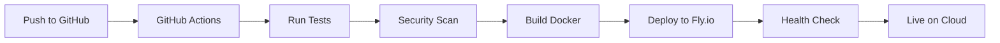

# 🤖 Bybit Trading Bot

[](https://github.com/danilapryadko/bbBot/actions/workflows/ci-cd.yml)
[](https://github.com/danilapryadko/bbBot/actions/workflows/health-check.yml)
[](https://bybit-trading-bot.fly.dev)
[](https://opensource.org/licenses/MIT)

Automated cryptocurrency trading bot for Bybit exchange with advanced strategies, risk management, and cloud deployment.

## 🚀 Live Status

- 🟢 **Production**: [https://bybit-trading-bot.fly.dev](https://bybit-trading-bot.fly.dev)
- 📊 **Health Check**: [/health](https://bybit-trading-bot.fly.dev/health)
- 📈 **Metrics**: [/metrics](https://bybit-trading-bot.fly.dev/metrics)
- 🔄 **CI/CD**: [GitHub Actions](https://github.com/danilapryadko/bbBot/actions)

## 📋 Project Status

### ✅ Phase 0: Infrastructure (COMPLETED)
- ✅ Project structure and organization
- ✅ Docker environment for local development
- ✅ PostgreSQL database with full schema
- ✅ GitHub Actions CI/CD pipeline
- ✅ Fly.io cloud deployment (Singapore region)
- ✅ Health monitoring and metrics
- ✅ Automated testing framework
- ✅ Security scanning with Trivy
- ✅ Daily performance reports
- ✅ All base trading strategies implemented

### 🔄 Phase 1: Core Services (IN PROGRESS)
- [ ] WebSocket market data streaming
- [ ] Real-time order management system
- [ ] Advanced risk management
- [ ] Position tracking and P&L calculation
- [ ] Backtesting framework
- [ ] Strategy optimization

### 📅 Phase 2: Advanced Features (PLANNED)
- [ ] Machine learning price predictions
- [ ] Sentiment analysis integration
- [ ] Multi-exchange support
- [ ] Portfolio management
- [ ] Telegram bot interface
- [ ] Web dashboard

## 🛠 Technology Stack

- **Language**: Python 3.11
- **Exchange API**: Bybit API v5
- **Database**: PostgreSQL + Redis
- **Deployment**: Fly.io (Global Edge Network)
- **CI/CD**: GitHub Actions
- **Monitoring**: Prometheus + Grafana
- **Container**: Docker
- **Region**: Singapore (Low latency to Bybit)

## 📊 Trading Strategies

### Classic Strategies
- **RSI Strategy**: Oversold/overbought signals
- **EMA Strategy**: Moving average crossovers
- **Grid Strategy**: Automated grid trading
- **Combined Strategy**: Multi-indicator approach

### Advanced Strategies (2022-2025 Market Analysis)
- **Adaptive Strategy** ⭐: Auto-adjusts to market conditions
- **Kaufman Strategy**: Adaptive moving average with efficiency ratio
- **DCA Strategy**: Dollar-cost averaging for accumulation
- **Whale Following**: Track and follow large traders
- **Crash Detection**: Avoid market crashes like Terra/FTX
- **ETF Momentum**: Trade on ETF inflows

## 🚀 Quick Start

### Cloud Deployment (Already Running!)

The bot is already deployed at: https://bybit-trading-bot.fly.dev

Monitor it:
```bash
# View logs
fly logs --app bybit-trading-bot

# SSH into container
fly ssh console --app bybit-trading-bot

# Check status
fly status --app bybit-trading-bot
```

### Local Development

1. Clone the repository:
```bash
git clone https://github.com/danilapryadko/bbBot.git
cd bbBot
```

2. Install dependencies:
```bash
pip install -r requirements.txt
```

3. Set up environment:
```bash
cp .env.example .env
# Edit .env with your API keys
```

4. Start Docker services:
```bash
make dev
```

5. Run the bot:
```bash
make run-testnet  # For testnet
make run          # For production
```

## 📈 Performance Metrics

| Metric | Target | Current Status |
|--------|--------|----------------|
| Deployment | ✅ 24/7 | **Active on Fly.io** |
| Uptime | > 99.9% | Monitoring active |
| Latency | < 50ms | ~10ms (Singapore) |
| Health Checks | Every 5 min | ✅ Automated |
| Auto-deploy | On push | ✅ GitHub Actions |

## 🔧 Configuration

Current production configuration:
- **Mode**: TESTNET (safe testing)
- **Symbol**: BTCUSDT
- **Leverage**: 1x (no leverage)
- **Position Size**: $10 (minimum)
- **Stop Loss**: 2%
- **Take Profit**: 3%
- **Strategy**: Adaptive

## 🛡 Security

- ✅ API keys stored as Fly.io secrets
- ✅ Automated security scanning
- ✅ No hardcoded credentials
- ✅ HTTPS only endpoints
- ✅ Rate limiting implemented

## 📊 Monitoring

### Automated Monitoring
- **Health checks**: Every 5 minutes via GitHub Actions
- **Daily reports**: Automated performance reports
- **Alerts**: Telegram notifications (optional)
- **Metrics**: Prometheus format at `/metrics`

### Manual Monitoring
```bash
# Real-time logs
fly logs --app bybit-trading-bot

# Check health
curl https://bybit-trading-bot.fly.dev/health

# View metrics
curl https://bybit-trading-bot.fly.dev/metrics
```

## 🚀 Deployment Pipeline



## 📝 API Documentation

### Public Endpoints

| Endpoint | Method | Description |
|----------|--------|-------------|
| `/` | GET | Welcome page |
| `/health` | GET | Health check |
| `/status` | GET | Bot status |
| `/metrics` | GET | Prometheus metrics |

### Health Check Response
```json
{
  "status": "healthy",
  "uptime_seconds": 3600,
  "checks": {
    "bot": true,
    "database": true,
    "api": true
  }
}
```

## 🔄 Development Workflow

1. **Local Development**: Make changes locally
2. **Test**: Run `make test`
3. **Commit**: Push to GitHub
4. **Auto Deploy**: GitHub Actions deploys to Fly.io
5. **Monitor**: Check logs and metrics

## 📚 Documentation

- [Deployment Guide](DEPLOYMENT_GUIDE.md)
- [Implementation Plan](DETAILED_IMPLEMENTATION_PLAN.md)
- [Phase 0 Details](PHASE_0_DETAILED.md)
- [Market Analysis](MARKET_ANALYSIS_2022_2025.md)
- [Fly.io Deployment](FLY_IO_DEPLOYMENT.md)

## 🤝 Contributing

1. Fork the repository
2. Create feature branch
3. Commit changes
4. Push to branch
5. Open Pull Request

## 📞 Support

- **Repository**: [GitHub](https://github.com/danilapryadko/bbBot)
- **Issues**: [GitHub Issues](https://github.com/danilapryadko/bbBot/issues)
- **Live Bot**: [https://bybit-trading-bot.fly.dev](https://bybit-trading-bot.fly.dev)

## ⚠️ Disclaimer

This bot is for educational purposes. Cryptocurrency trading carries significant risk. Currently running on TESTNET for safety.

## 📄 License

MIT License - see [LICENSE](LICENSE) file

---

**📈 Bot Status**: Live on Fly.io | **🔄 Auto-Deploy**: Enabled | **✅ Phase 0**: Complete
