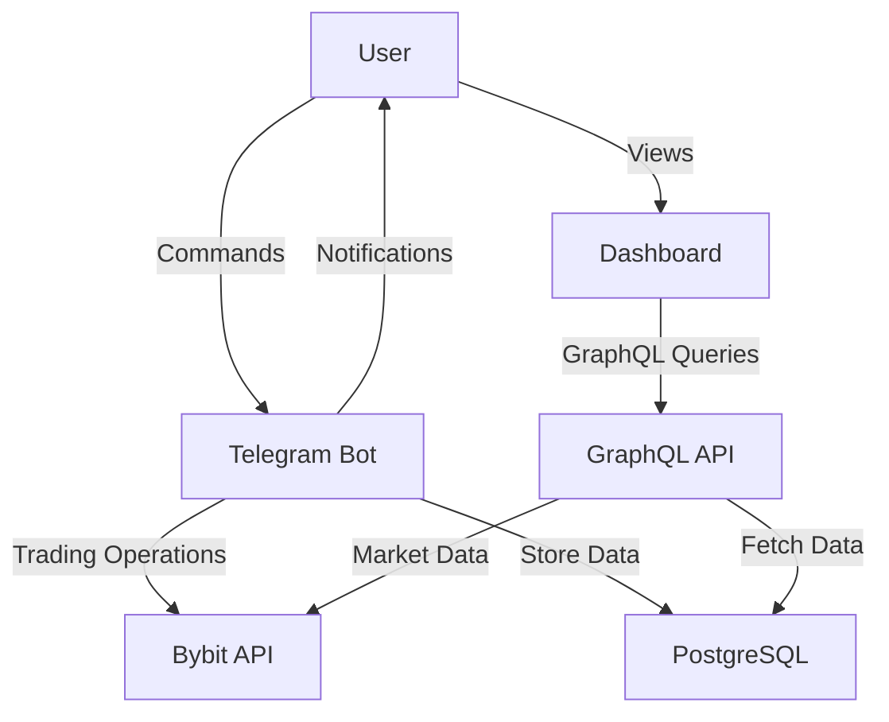

# 🏗️ Microservices Architecture

## System Architecture Overview

The Bybit Trading Bot is built using a microservices architecture that separates concerns and allows for independent scaling and deployment.

## Services

### 1. Telegram Bot Service (`bybit-danila-bot`)
**Purpose:** Handles all Telegram user interactions
- Receives commands from users
- Sends trading notifications
- Manages user authentication
- Executes trading operations

**Technology Stack:**
- Python 3.11
- python-telegram-bot
- pybit (Bybit API)
- PostgreSQL client

**Deployment:**
- Platform: Fly.io
- Region: Singapore (sin)
- Memory: 256MB
- CPU: 1 shared

### 2. GraphQL API Service (`bybit-danila-api`)
**Purpose:** Provides data API for dashboard and external integrations
- Real-time balance queries
- Position management
- Trading history
- Market data

**Technology Stack:**
- Python 3.11
- FastAPI
- Ariadne (GraphQL)
- pybit (Bybit API)
- PostgreSQL client

**Deployment:**
- Platform: Fly.io
- Region: Singapore (sin)
- Memory: 512MB
- CPU: 1 shared
- Exposed ports: 80, 443

### 3. Dashboard (Frontend)
**Purpose:** Web interface for monitoring and control
- Real-time balance display
- Position monitoring
- Trading history visualization
- Performance metrics

**Technology Stack:**
- React 18
- TypeScript
- Apollo Client (GraphQL)
- Chart.js

**Deployment:**
- Platform: Fly.io (separate app)
- Static site hosting

## Data Flow



## Communication Patterns

### Inter-Service Communication
- Services communicate through shared PostgreSQL database
- No direct service-to-service communication (reduces coupling)
- Event-driven updates through database triggers (future enhancement)

### External Communication
- **Telegram Bot:** Long polling to Telegram servers
- **GraphQL API:** HTTP/HTTPS REST endpoints
- **Dashboard:** GraphQL over HTTPS

## Database Schema

### Core Tables
1. **users** - Telegram user information and permissions
2. **trades** - Historical trade records
3. **positions** - Current open positions
4. **balances** - Balance snapshots over time
5. **bot_status** - Bot operational status
6. **ml_predictions** - ML model predictions and accuracy

## Security Architecture

### Authentication & Authorization
- **Telegram Bot:** User ID whitelist (`TELEGRAM_ALLOWED_USERS`)
- **GraphQL API:** JWT tokens (future implementation)
- **Dashboard:** API key authentication

### Secrets Management
- All secrets stored in Fly.io secrets
- No hardcoded credentials
- Environment-specific configurations

### Network Security
- HTTPS/TLS for all external communications
- Private networking between services (via database)
- Rate limiting on API endpoints

## Scalability Patterns

### Horizontal Scaling
Each service can be scaled independently:
```bash
# Scale API service
fly scale count 3 -a bybit-danila-api

# Scale bot service (usually not needed)
fly scale count 1 -a bybit-danila-bot
```

### Vertical Scaling
Adjust resources per service:
```bash
# Increase API memory
fly scale memory 1024 -a bybit-danila-api

# Increase bot CPU
fly scale vm shared-cpu-2x -a bybit-danila-bot
```

## Monitoring & Observability

### Health Checks
- **Telegram Bot:** Process health check
- **GraphQL API:** `/health` endpoint
- **Database:** Connection pool monitoring

### Metrics
- Request latency
- Error rates
- Trading performance
- System resources

### Logging
- Centralized logging per service
- Structured JSON logs
- Log levels: DEBUG, INFO, WARNING, ERROR

## Deployment Strategy

### CI/CD Pipeline
1. Code push to GitHub
2. Run tests
3. Build Docker images
4. Deploy to Fly.io
5. Health check validation
6. Rollback on failure

### Zero-Downtime Deployment
- Rolling updates for API service
- Blue-green deployment for bot service
- Database migrations with backward compatibility

## Disaster Recovery

### Backup Strategy
- Daily database backups
- Code repository backups
- Configuration backups

### Recovery Procedures
1. **Service Failure:** Automatic restart by Fly.io
2. **Data Loss:** Restore from PostgreSQL backup
3. **Complete Failure:** Redeploy from GitHub

## Future Enhancements

### Planned Services
1. **Webhook Service** - Real-time market data updates
2. **Analytics Service** - Advanced trading analytics
3. **ML Service** - Dedicated machine learning predictions
4. **Notification Service** - Multi-channel notifications

### Infrastructure Improvements
- Kubernetes migration for better orchestration
- Service mesh for advanced traffic management
- Event streaming with Kafka/RabbitMQ
- Distributed tracing with OpenTelemetry

## Service Dependencies

```yaml
telegram-bot:
  depends_on:
    - postgresql
    - bybit-api
  
graphql-api:
  depends_on:
    - postgresql
    - bybit-api

dashboard:
  depends_on:
    - graphql-api
```

## Resource Requirements

### Minimum Requirements
- **Telegram Bot:** 256MB RAM, 1 CPU
- **GraphQL API:** 512MB RAM, 1 CPU
- **PostgreSQL:** 1GB RAM, 1 CPU
- **Dashboard:** Static hosting

### Recommended Production
- **Telegram Bot:** 512MB RAM, 1 CPU
- **GraphQL API:** 1GB RAM, 2 CPU
- **PostgreSQL:** 2GB RAM, 2 CPU
- **Dashboard:** CDN deployment